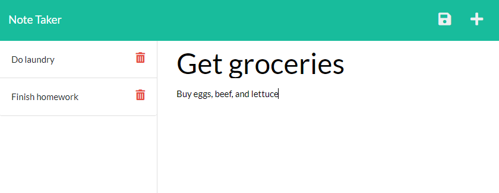

# Note Taker

[Link to Deployed Application](https://note-taker-kj2022.herokuapp.com/notes)

Here's a screenshot of the finished application:

---

## Description
Writing down notes to better organize your day.

## Table of Contents
- [Installation](#installation)
- [Usage](#usage)
- [Credits](#credits)

## Installation
N/A

## Usage
Keeping track of your life.

## Contributing
N/A

## Tests
N/A

## Questions
If you have any questions related to this project, contact through my [GitHub](https://github.com/kieferjackson) or contact at the following email address: [kieferleejackson@gmail.com](kieferleejackson@gmail.com)

## Credits
This project was developed by [kieferjackson](https://github.com/kieferjackson)
